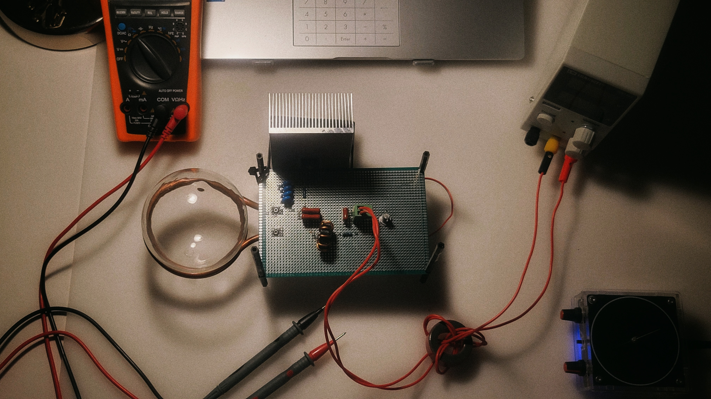

# Plasmas toroïdaux

**De l’induction radiofréquence aux cycles solaires :
les tores de plasma, sources de stabilité annulaire**

> Il s’agit ainsi de comprendre comment une décharge inductive sans électrodes peut former un plasma soumis à un confinement toroïdal analogue à l’organisation des tubes de flux magnétiques solaires, afin d’en caractériser expérimentalement le cycle électromagnétique de maintien et d’étudier les conditions physiques dans lesquelles cette analogie demeure pertinente.

La démarche proposée vise à obtenir et observer la formation d’un plasma toroïdal par décharge inductive, puis à déterminer expérimentalement les paramètres assurant sa stabilité ainsi que ses caractéristiques intrinsèques et leurs variations, afin de les comparer aux attendus de la modélisation théorique établie en parallèle.

Enfin, une mise en perspective astrophysique est développée afin d’évaluer dans quelle mesure le tore obtenu permet d'expliquer le comportement des tubes de flux magnétiques solaires ainsi que leur rôle clé dans le cycle solaire, de leur confinement toroïdal stable sous la photosphère jusqu’aux éjections de masse coronale en surface.

---

Vous trouverez ici les documents importants relatifs à ce projet tels que les fichiers sources  – dont Fritzing – du circuit électronique réalisé ainsi que le fichier de présentation du projet.

